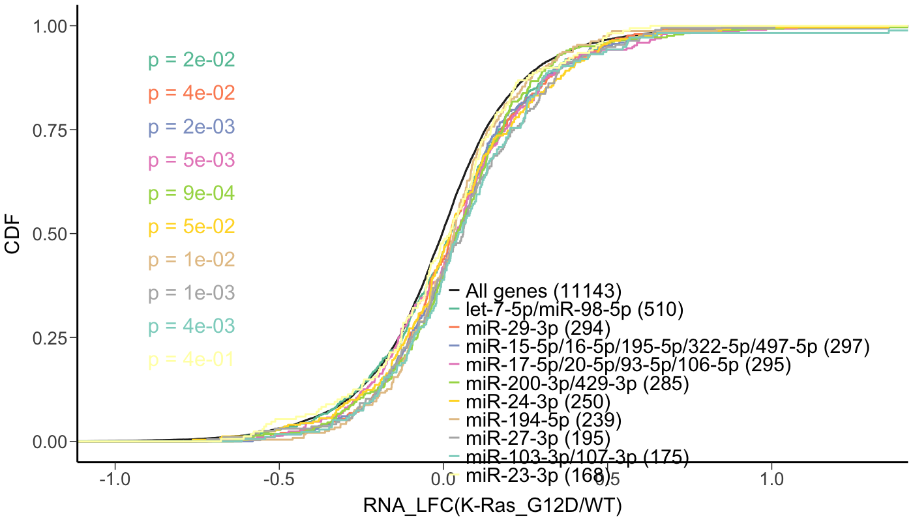
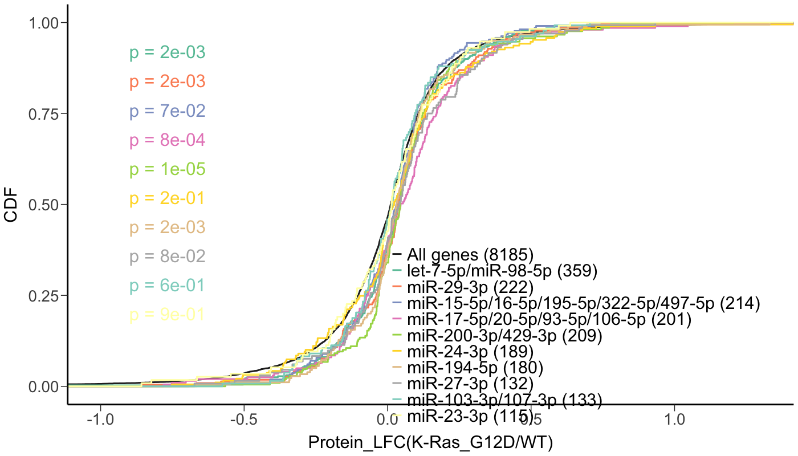
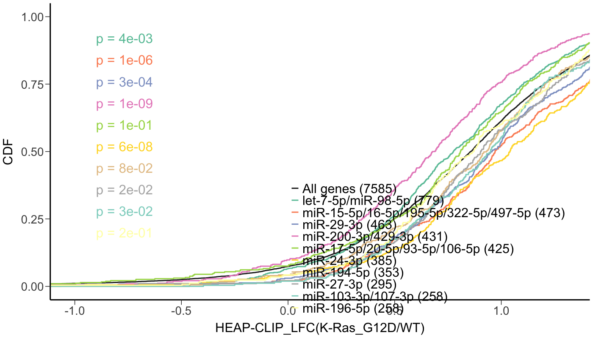

```{r setup, include=FALSE}
knitr::opts_chunk$set(echo = TRUE)
```

## Library setup

```{r}
suppressMessages(
  suppressWarnings(
    c(library(DESeq2),
      library(data.table),
      library(gdata),
      library(rtracklayer),
      library(BSgenome),
      library(VennDiagram),
      library(ggplot2),
      library(biomaRt),
      library(RColorBrewer),
      library(readr),
      library(ensembldb),
      library(EnsDb.Mmusculus.v79),
      library(org.Mm.eg.db),
      library(AnnotationDbi),
      library(tidyverse),
      library(plotly),
      library(knitr)
      )))
```

## CDF analysis using RNA-Seq data
Set up the function
```{r}
plotCDF.ggplot <- function(gene.counts, gene.sets, gene.set.labels,
                           col = "", linetype = "", xlim = c( -1.0, 1.3 ),
                           legend.size = 22, axistitle.size = 22, title = "Fold change log2 (Dicer KO/WT)",
                           legend.pos = c(0.7, 0.18)) {
  require(ggplot2)
  df.log2fc <- gene.counts[,c("gene", "log2FC")]
  #rownames(df.log2fc) <- df.log2fc$gene
  if (length(gene.sets) != length(gene.set.labels)){
    return("Length of gene sets doesn't match labels")
  }
  target.expr <- df.log2fc[df.log2fc$gene %in% gene.sets[[1]],]
  for (i in 2:length(gene.sets)){
    target.expr <- rbind(target.expr, df.log2fc[df.log2fc$gene %in% gene.sets[[i]],])
  }

  gene.set.counts <- c()
  for (j in 1:length(gene.sets)){
    gene.set.counts <- c(gene.set.counts, sum(df.log2fc$gene %in% gene.sets[[j]]))
  }
  
  target.expr$Category <- rep(gene.set.labels, gene.set.counts)
  target.expr$Category <- factor(target.expr$Category, levels = gene.set.labels)
  
  log2FC.values <- lapply(gene.sets, function(gene.set) {
    gene.counts[gene.counts$gene %in% gene.set,]$log2FC
  })

  ks.pvals <- lapply(log2FC.values,
                     function(log2FCs) {
                       ks.test(log2FCs, log2FC.values[[1]])$p.value
                     })
  
  p <- ggplot( target.expr, aes( x = log2FC, colour = Category ) ) +
  stat_ecdf( geom = 'step', aes( colour = Category, linetype = Category ), lwd = 1 ) +
  scale_color_manual( values = col, labels = sprintf( "%s (%d)", gene.set.labels, gene.set.counts ) ) +
  scale_linetype_manual( values = linetype, labels = sprintf( "%s (%d)", gene.set.labels, gene.set.counts ) ) +
  # xlim() will remove data points; Be careful in the future
  coord_cartesian( xlim = xlim ) + xlab(title) + ylab('CDF') +
  theme_classic() + theme( legend.background = element_rect(fill = NA), 
                           legend.title = element_blank(), 
                           legend.position = legend.pos,
                           legend.text = element_text(size=legend.size),
                           legend.key.size = unit(1.5, 'lines'),
                           axis.title.x = element_text(size=axistitle.size, margin = margin(t = 10)),
                           axis.title.y = element_text(size=axistitle.size, margin = margin(r = 10)),
                           axis.text=element_text(size=20),
                           axis.line = element_line(size = 1),  #axis label size
                           axis.ticks.length = unit(0.3, "cm")) #increase tick length
  
  for (k in 2:length(gene.sets)){
    p <- p + annotate(geom = "text", x = -0.9, y = 1-0.08*(k-1), hjust = 0, 
                      label = sprintf("p = %.0e", ks.pvals[k]), 
                      colour = col[k], size = 8)
  }
  print(p)
}
```

Load the enema model RNA-Seq DGE dataset.
```{r}
rna_DGE <- read_csv("~/OneDrive - Harvard University/Haigis Lab/Projects/Halo-Ago2/Halo-Ago-KRas/Raw Data/RNA-Seq/Mouse colon tumor/4-OHT enema model/Analysis/Differential Analysis_filtered.csv")
```

Now load the list of peaks associated with each miRNA.
```{r}
peaks.mir <- readRDS("Datafiles/peaks-mirs-200-09282019.rds")

# First we need to nnotate each peak with its potential target gene, 3'UTR annotation gets priority.
peaks.mir$'target_gene' <- NA
for (i in 1:length(peaks.mir)) {
  if (!is.na(peaks.mir$utr3[i]) | !is.na(peaks.mir$`utr3*`[i])) {
    gene_name <- unique(c(peaks.mir$utr3[i],peaks.mir$`utr3*`[i]))
    gene_name <- gene_name[!is.na(gene_name)] 
    peaks.mir$'target_gene'[i] <- paste(unlist(gene_name), collapse = " ")
  }
  else {
    gene_name <- unique(c(peaks.mir$exon[i], peaks.mir$intron[i],peaks.mir$utr5[i],peaks.mir$`utr5*`[i]))
    gene_name <- gene_name[!is.na(gene_name)]
    if (length(gene_name) >0) {
    peaks.mir$'target_gene'[i] <- paste(unlist(gene_name), collapse = " ")
    }
  }
}

```


Now I need to annotate the target list with both Ensembl ID and Uniprot ID and Enterez ID (for KEGG and GSEA).
```{r}
# annotate with Ensembl ID
# Ensembl IDs are annotated using `EnsDb.Mmusculus.v79` package since that is the one that I used for RNA-Seq analysis
target_gene_list <- peaks.mir$target_gene[!is.na(peaks.mir$target_gene)]
annotations_ensembl <- AnnotationDbi::select(EnsDb.Mmusculus.v79,
                                           keys = as.character(target_gene_list),
                                           columns = c("GENEID"),
                                           keytype = "GENENAME")

# Determine the indices for the non-duplicated genes
non_duplicates_idx <- which(duplicated(annotations_ensembl$GENEID) == FALSE)

# Return only the non-duplicated genes using indices
annotations_ensembl <- annotations_ensembl[non_duplicates_idx, ]

# Check number of NAs returned
is.na(annotations_ensembl$GENENAME) %>%
  which() %>%
  length()

# annotate the dataset with Ensembl ID
peaks.mir$target_Ensembl_ID <- NA
peaks.mir <- peaks.mir[!is.na(peaks.mir$target_gene)]
for (i in 1:length(peaks.mir)) {
  index <- grep(peaks.mir$target_gene[i], annotations_ensembl$GENENAME)
  if (length(index)>0) {
    peaks.mir$target_Ensembl_ID[i] <- paste(annotations_ensembl$GENEID[index], collapse = " ")
  }
}

# annotate the dataset with Uniprot ID
## first I need to generate a list of genes to retrieve Uniprot ID from the website
peak.targets <- unique(peaks.mir$target_gene)
write.csv(peak.targets, "all_peaks.csv")

uniprot_ID <- read_csv("all_peaks_Uniprot.csv")

peaks.mir$target_Uniprot_ID <- NA
for (i in 1:length(peaks.mir)) {
  index <- grep(peaks.mir$target_gene[i], uniprot_ID$gene_name)
  if (length(index)>0) {
    peaks.mir$target_Uniprot_ID[i] <- paste(uniprot_ID$Entry[index], collapse = " ")
  }
}

## filter out targets with no ID
no_id <- setdiff(peak.targets, uniprot_ID$gene_name)
write.csv(no_id, "no_UniprotID.csv")

## load the manually annotated ID list
no.id.2.id <- read_csv("no_UniprotID_2_ID.csv", col_names = FALSE)

for (i in 1:dim(no.id.2.id)[1]) {
  index <- grep(no.id.2.id$X1[i], peaks.mir$target_gene)
  if (length(index)>0) {
    peaks.mir$target_Uniprot_ID[index] <- paste(no.id.2.id$X2[i], collapse = " ")
  }
}

# number of genes with UniprotID
length(unique(peaks.mir$target_Uniprot_ID[!is.na(peaks.mir$target_Uniprot_ID)]))

# annotate with Entrez ID
# Entrez IDs are annotated using `org.Mm.eg.db` package since this is the most updated
annotations_entrez <- AnnotationDbi::select(org.Mm.eg.db,
                                           keys = as.character(target_gene_list),
                                           columns = c("ENTREZID"),
                                           keytype = "SYMBOL")

# Determine the indices for the non-duplicated genes
non_duplicates_idx <- which(duplicated(annotations_entrez$ENTREZID) == FALSE)

# Return only the non-duplicated genes using indices
annotations_entrez <- annotations_entrez[non_duplicates_idx, ]

# Check number of NAs returned
is.na(annotations_entrez$ENTREZID) %>%
  which() %>%
  length()

# annotate the dataset with Entrez ID
peaks.mir$target_Entrez_ID <- NA
peaks.mir <- peaks.mir[!is.na(peaks.mir$target_gene)]
for (i in 1:length(peaks.mir)) {
  index <- grep(peaks.mir$target_gene[i], annotations_entrez$SYMBOL)
  if (length(index)>0) {
    peaks.mir$target_Entrez_ID[i] <- paste(annotations_entrez$ENTREZID[index], collapse = " ")
  }
}

# save the datafile
saveRDS(peaks.mir, "Datafiles/peaks-mirs-200-09282019-withID.rds")
```

Now we group peaks by miRNA.
```{r}
targetofmiR <- function(peaks.mir = brain.peaks.mirs,
                        miRNA = "",
                        sitetype = "8mer"){
  peaks.mir.sub <- as.data.frame(peaks.mir[,c("log2FC", "padj", 
                                              "seed.8mer", "seed.7m8", "seed.7A1", "seed.6mer")])
  peaks.seedmatch <- lapply(c("seed.8mer", "seed.7m8", "seed.7A1", "seed.6mer"),
                            function(seed){
                              map <- peaks.mir.sub[grepl(miRNA, peaks.mir.sub[,seed]),]
                              map <- rownames(map)
                              map
                            })
  names(peaks.seedmatch) <- c("seed.8mer", "seed.7m8", "seed.7A1", "seed.6mer")

  if (sitetype == "8mer"){
    maps <- peaks.seedmatch[[1]]
  } else if (sitetype == "7mer_above"){
    maps <- unique(unlist(peaks.seedmatch[1:3]))
  } else if (sitetype == "7mer"){
    maps <- unique(unlist(peaks.seedmatch[2:3]))
  } else if (sitetype == "6mer"){
    maps <- peaks.seedmatch[[4]]
  } else {
    print("Please input site type as: 8mer, 7mer_above, 7mer or 6mer")
  }
    return(peaks.mir[maps])
}
```


```{r}
mirna.family.DGE <- readRDS("Datafiles/mirna-counts-deseq-by-family-09282019.rds")
mirs <- subset(mirna.family.DGE, baseMean > 200)
mirs <- mirs$miR.family

mirs.peaks <- lapply(mirs,
                     function(mir){
                       targetofmiR(miRNA = mir,
                                   peaks.mir = peaks.mir,
                                   sitetype = "7mer_above")
                     })
names(mirs.peaks) <- mirs
saveRDS(mirs.peaks, "Datafiles/miRNA-peaks-list-09282019-withIDs.rds")
```

Now we can draw the CAD plots for specific miRNAs. I will do the top 10 that have the most peaks associated.
```{r}
colnames(rna_DGE)[1] <- "gene"
colnames(rna_DGE)[3] <- "log2FC"
cols <- c(brewer.pal(name = "Set2", n = 8), brewer.pal(name = "Set3", n = 3))
plotCDF.ggplot(rna_DGE,
               list(rna_DGE$gene, peaks.mir$target_Ensembl_ID),
               c("All genes", "miRNAs over 200"),
               col = c("grey15", cols[1]),
               linetype = c(1, 1),
               title = "RNA_LFC(K-Ras_G12D/WT)"
               )

```


```{r}
len <- sapply(mirs.peaks, function(x) length(x))
mirs.peaks <- mirs.peaks[order(-len)]
mirna <- names(mirs.peaks)

for (i in 1:10) {
  plotCDF.ggplot(rna_DGE,
               list(rna_DGE$gene, mirs.peaks[[i]]$target_Ensembl_ID),
               c("All genes", mirna[i]),
               col = c("grey15", cols[i]),
               linetype = c(1, 1),
               title = "RNA_LFC(K-Ras_G12D/WT)"
               )
}
```

```{r fig.align="center", fig.height=10}
png('RNA_CDF.png',
    height = 800,
    width = 1400,
    res = 100,
    pointsize = 8)
plotCDF.ggplot(rna_DGE,
               list(rna_DGE$gene, 
                    mirs.peaks[[1]]$target_Ensembl_ID,
                    mirs.peaks[[2]]$target_Ensembl_ID,
                    mirs.peaks[[3]]$target_Ensembl_ID,
                    mirs.peaks[[4]]$target_Ensembl_ID,
                    mirs.peaks[[5]]$target_Ensembl_ID,
                    mirs.peaks[[6]]$target_Ensembl_ID,
                    mirs.peaks[[7]]$target_Ensembl_ID,
                    mirs.peaks[[8]]$target_Ensembl_ID,
                    mirs.peaks[[9]]$target_Ensembl_ID,
                    mirs.peaks[[10]]$target_Ensembl_ID),
               c("All genes", mirna[1], mirna[2], mirna[3], mirna[4], mirna[5], mirna[6], mirna[7], mirna[8], mirna[9], mirna[10]),
               col = c("grey15", cols[1:10]),
               linetype = c(1, 1, 1, 1, 1, 1, 1, 1, 1, 1, 1),
               title = "RNA_LFC(K-Ras_G12D/WT)"
               )
dev.off()



pdf('RNA_CDF.pdf',
    height = 8,
    width = 14)
plotCDF.ggplot(rna_DGE,
               list(rna_DGE$gene, 
                    mirs.peaks[[1]]$target_Ensembl_ID,
                    mirs.peaks[[2]]$target_Ensembl_ID,
                    mirs.peaks[[3]]$target_Ensembl_ID,
                    mirs.peaks[[4]]$target_Ensembl_ID,
                    mirs.peaks[[5]]$target_Ensembl_ID,
                    mirs.peaks[[6]]$target_Ensembl_ID,
                    mirs.peaks[[7]]$target_Ensembl_ID,
                    mirs.peaks[[8]]$target_Ensembl_ID,
                    mirs.peaks[[9]]$target_Ensembl_ID,
                    mirs.peaks[[10]]$target_Ensembl_ID),
               c("All genes", mirna[1], mirna[2], mirna[3], mirna[4], mirna[5], mirna[6], mirna[7], mirna[8], mirna[9], mirna[10]),
               col = c("grey15", cols[1:10]),
               linetype = c(1, 1, 1, 1, 1, 1, 1, 1, 1, 1, 1),
               title = "RNA_LFC(K-Ras_G12D/WT)"
               )
dev.off()
```

### Boxplot
```{r}
# define the function
plotBoxplot.ggplot <- function(gene.counts, gene.sets, gene.set.labels) {
  require(ggplot2)
  df.log2fc <- gene.counts[,c("gene", "log2FC")]
  #rownames(df.log2fc) <- df.log2fc$gene
  if (length(gene.sets) != length(gene.set.labels)){
    return("Length of gene sets doesn't match labels")
  }
  target.expr <- df.log2fc[df.log2fc$gene %in% gene.sets[[1]],]
  for (i in 2:length(gene.sets)){
    target.expr <- rbind(target.expr, df.log2fc[df.log2fc$gene %in% gene.sets[[i]],])
  }

  gene.set.counts <- c()
  for (j in 1:length(gene.sets)){
    gene.set.counts <- c(gene.set.counts, sum(df.log2fc$gene %in% gene.sets[[j]]))
  }
  
  target.expr$Category <- rep(gene.set.labels, gene.set.counts)
  target.expr$Category <- factor(target.expr$Category, levels = gene.set.labels)
  
  p <- ggplot(target.expr, aes(x=Category, y=log2FC, fill = Category)) + geom_boxplot() + xlab("") + 
  ylab("log2FC(KRas-G12D/WT)") + scale_fill_manual(values = cols[1:length(gene.sets)]) + theme(axis.text.x =element_text(angle = 90, hjust = 1))
  
  print(p)
}

```

```{r}
#get a list of gene sets from the top 10 miRNA
gene.list <- c()
for (i in 1:10) {
  gene.list <- c(gene.list, list(mirs.peaks[[i]]$target_Ensembl_ID))
}

plotBoxplot.ggplot(rna_DGE,
               c(list(rna_DGE$gene), gene.list),
               c("All genes", mirna[1:10])
               ) + ylim(-2,2)
```


## CAD analysis using proteomics data
Load the proteomic dataset
```{r}
protein_DGE <- read_csv("~/OneDrive - Harvard University/Haigis Lab/Projects/Halo-Ago2/Halo-Ago-KRas/Raw Data/Proteomics data/colon tumor-enema model/crcMS_diff.csv")
```
```{r}
colnames(protein_DGE)[2] <- "gene"
colnames(protein_DGE)[7] <- "log2FC"
cols <- c(brewer.pal(name = "Set2", n = 8), brewer.pal(name = "Set3", n = 3))
plotCDF.ggplot(protein_DGE,
               list(protein_DGE$gene, peaks.mir$target_Uniprot_ID),
               c("All genes", "miRNAs over 200"),
               col = c("grey15", cols[1]),
               linetype = c(1, 1),
               title = "Protein_LFC(K-Ras_G12D/WT)"
               )
```
```{r}
for (i in 1:10) {
  plotCDF.ggplot(protein_DGE,
               list(protein_DGE$gene, mirs.peaks[[i]]$target_Uniprot_ID),
               c("All genes", mirna[i]),
               col = c("grey15", cols[i]),
               linetype = c(1, 1, 1, 1, 1, 1, 1, 1, 1, 1, 1),
               title = "Protein_LFC(K-Ras_G12D/WT)"
               )
}
```

```{r fig.align="center", fig.height=10}
png('Protein_CDF.png',
    height = 800,
    width = 1400,
    res = 100,
    pointsize = 8)
plotCDF.ggplot(protein_DGE,
               list(protein_DGE$gene, 
                    mirs.peaks[[1]]$target_Uniprot_ID,
                    mirs.peaks[[2]]$target_Uniprot_ID,
                    mirs.peaks[[3]]$target_Uniprot_ID,
                    mirs.peaks[[4]]$target_Uniprot_ID,
                    mirs.peaks[[5]]$target_Uniprot_ID,
                    mirs.peaks[[6]]$target_Uniprot_ID,
                    mirs.peaks[[7]]$target_Uniprot_ID,
                    mirs.peaks[[8]]$target_Uniprot_ID,
                    mirs.peaks[[9]]$target_Uniprot_ID,
                    mirs.peaks[[10]]$target_Uniprot_ID),
               c("All genes", mirna[1], mirna[2], mirna[3], mirna[4], mirna[5], mirna[6], mirna[7], mirna[8], mirna[9], mirna[10]),
               col = c("grey15", cols[1:10]),
               linetype = c(1, 1, 1, 1, 1, 1, 1, 1, 1, 1, 1),
               title = "Protein_LFC(K-Ras_G12D/WT)"
               )
dev.off()



pdf('Protein_CDF.pdf',
    height = 8,
    width = 14)
plotCDF.ggplot(protein_DGE,
               list(protein_DGE$gene, 
                    mirs.peaks[[1]]$target_Uniprot_ID,
                    mirs.peaks[[2]]$target_Uniprot_ID,
                    mirs.peaks[[3]]$target_Uniprot_ID,
                    mirs.peaks[[4]]$target_Uniprot_ID,
                    mirs.peaks[[5]]$target_Uniprot_ID,
                    mirs.peaks[[6]]$target_Uniprot_ID,
                    mirs.peaks[[7]]$target_Uniprot_ID,
                    mirs.peaks[[8]]$target_Uniprot_ID,
                    mirs.peaks[[9]]$target_Uniprot_ID,
                    mirs.peaks[[10]]$target_Uniprot_ID),
               c("All genes", mirna[1], mirna[2], mirna[3], mirna[4], mirna[5], mirna[6], mirna[7], mirna[8], mirna[9], mirna[10]),
               col = c("grey15", cols[1:10]),
               linetype = c(1, 1, 1, 1, 1, 1, 1, 1, 1, 1, 1),
               title = "Protein_LFC(K-Ras_G12D/WT)"
               )
dev.off()
```

### Boxplots
```{r}
# get a list of gene sets from the top 10 miRNA
gene.list <- c()
for (i in 1:10) {
  gene.list <- c(gene.list, list(mirs.peaks[[i]]$target_Uniprot_ID))
}

plotBoxplot.ggplot(protein_DGE,
               c(list(protein_DGE$gene), gene.list),
               c("All genes", mirna[1:10])
               ) + ylim(-1,1)
```

## HEAP-CLIP peak intensity
This analysis will use the LFC of CLIP peak heights between HVAK and HVA samples.

### CDF plots
```{r}
clip_DGE <- as.data.frame(cbind(peaks.mir$name, peaks.mir$hvak.hva.log2FC))
colnames(clip_DGE)[1] <- "gene"
colnames(clip_DGE)[2] <- "log2FC"
clip_DGE$log2FC <- as.numeric(as.character(clip_DGE$log2FC))
cols <- c(brewer.pal(name = "Set2", n = 8), brewer.pal(name = "Set3", n = 3))

for (i in 1:10) {
  plotCDF.ggplot(clip_DGE,
               list(clip_DGE$gene, mirs.peaks[[i]]$name),
               c("All peaks", mirna[i]),
               col = c("grey15", cols[i]),
               linetype = c(1, 1),
               title = "HEAP-CLIP_LFC(K-Ras_G12D/WT)",
               xlim = c(-1,3)
               )
}
```

```{r fig.align="center", fig.height=10}
png('CLIP_CDF.png',
    height = 800,
    width = 1400,
    res = 100,
    pointsize = 8)
plotCDF.ggplot(clip_DGE,
               list(clip_DGE$gene, 
                    mirs.peaks[[1]]$name,
                    mirs.peaks[[2]]$name,
                    mirs.peaks[[3]]$name,
                    mirs.peaks[[4]]$name,
                    mirs.peaks[[5]]$name,
                    mirs.peaks[[6]]$name,
                    mirs.peaks[[7]]$name,
                    mirs.peaks[[8]]$name,
                    mirs.peaks[[9]]$name,
                    mirs.peaks[[10]]$name),
               c("All genes", mirna[1], mirna[2], mirna[3], mirna[4], mirna[5], mirna[6], mirna[7], mirna[8], mirna[9], mirna[10]),
               col = c("grey15", cols[1:10]),
               linetype = c(1, 1, 1, 1, 1, 1, 1, 1, 1, 1, 1),
               title = "HEAP-CLIP_LFC(K-Ras_G12D/WT)"
               )
dev.off()



pdf('CLIP_CDF.pdf',
    height = 8,
    width = 14)
plotCDF.ggplot(clip_DGE,
               list(clip_DGE$gene, 
                    mirs.peaks[[1]]$name,
                    mirs.peaks[[2]]$name,
                    mirs.peaks[[3]]$name,
                    mirs.peaks[[4]]$name,
                    mirs.peaks[[5]]$name,
                    mirs.peaks[[6]]$name,
                    mirs.peaks[[7]]$name,
                    mirs.peaks[[8]]$name,
                    mirs.peaks[[9]]$name,
                    mirs.peaks[[10]]$name),
               c("All genes", mirna[1], mirna[2], mirna[3], mirna[4], mirna[5], mirna[6], mirna[7], mirna[8], mirna[9], mirna[10]),
               col = c("grey15", cols[1:10]),
               linetype = c(1, 1, 1, 1, 1, 1, 1, 1, 1, 1, 1),
               title = "HEAP-CLIP_LFC(K-Ras_G12D/WT)"
               )
dev.off()
```

### Box plots
```{r}
# get a list of gene sets from the top 10 miRNA
gene.list <- c()
for (i in 1:10) {
  gene.list <- c(gene.list, list(mirs.peaks[[i]]$name))
}

plotBoxplot.ggplot(clip_DGE,
               c(list(clip_DGE$gene), gene.list),
               c("All genes", mirna[1:10])
               )
```

## Correlate miRNA abundance with associated peak number
```{r}
# filter for miRNA with mean counts  > 200
mirna.family.DGE <- mirna.family.DGE[mirna.family.DGE$baseMean>200,]
mirna.family.DGE$peak.number <- NA
for (i in 1:length(mirna.family.DGE$miR.family)) {
  peak.number <- length(mirs.peaks[[i]])
  index <- grep(names(mirs.peaks)[i], mirna.family.DGE$miR.family)
  mirna.family.DGE$peak.number[index] <- peak.number
}

p1 <- ggplot(mirna.family.DGE, aes(x = log2(baseMean), y = peak.number, label = miR.family, size = peak.number)) +
  geom_point(colour = "#EC469A", alpha = 0.6) +
  geom_hline(yintercept = 0, linetype = "dashed", size = 0.3) +
  geom_vline(xintercept = 0, linetype = "dashed", size = 0.3) +
  xlab("Log2(Ago2-bound miRNA abundance)") +
  ylab("Number of HEAP-CLIP peaks mapped") +
  theme_bw() +
      theme(panel.border = element_blank(),
      panel.background = element_blank(),
      panel.grid.major = element_blank(), 
      panel.grid.minor = element_blank(),
      axis.title.x = element_text(size=12, margin = margin(t = 10)),
      axis.title.y = element_text(size=12, margin = margin(r = 10)),
      axis.text = element_text(size=10),
      axis.line.y = element_line(size = 0.5),
      axis.line.x = element_line(size = 0.5),
      axis.ticks.x = element_line(size = 0),
      axis.ticks.y = element_line(size = 0.5),
      plot.title = element_text(hjust = 0.5, size = 12, face = "bold")) + 
  xlim(5,18)
  
p1 <- ggplotly(p1)
p1

# calculate the correlation between these two factors
cor.test(log10(mirna.family.DGE$baseMean), mirna.family.DGE$peak.number)
```
